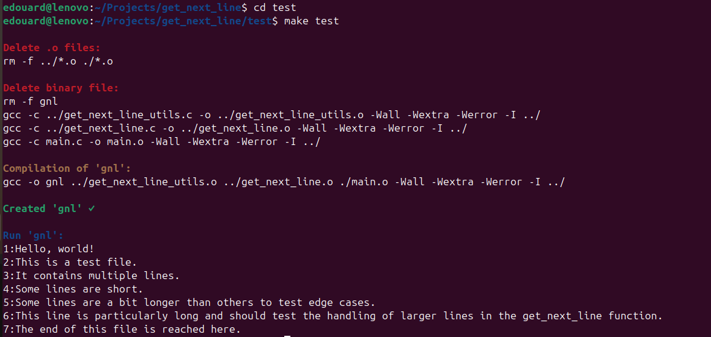
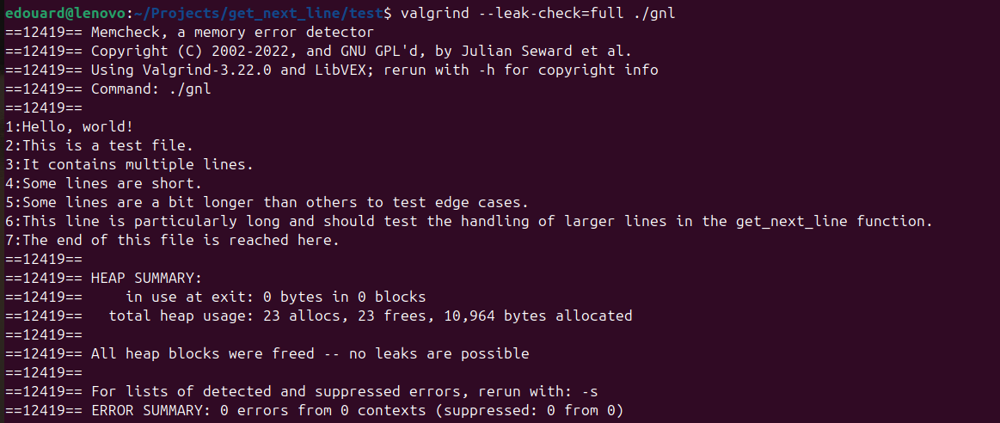
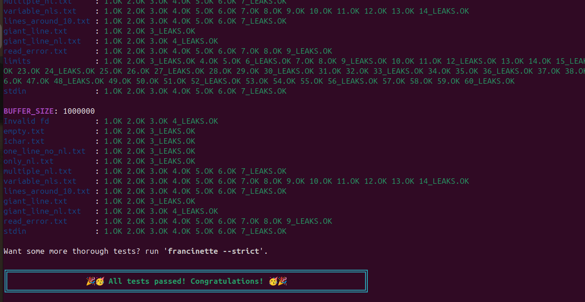

# 42 school / get_next_line

- **Location:** 42 School Barcelona
- **Validation:** November 2024
- **Subject:** [ENGLISH](./docs/en.subject.pdf) / [FRENCH](./docs/fr.subject.pdf) / [SPANISH](./docs/es.subject.pdf)

The "get_next_line" project at 42 School requires implementing a function that reads a single line from a file descriptor. It must manage multiple calls, handle dynamic memory allocation, and support files of any length. The project tests skills in file handling, memory management, and edge case considerations.

## How to use

1. Clone repo locally
2. Rename `..gitignore` into `.gitignore`
3. Push to you own repo

This way, only the files requested by the subject will be pushed to your repo.

### Output
```bash
cd test
make test
```



## Run tests

### Memory leaks
- Install [valgrind](https://valgrind.org/): `sudo apt update && sudo apt install valgrind`
- Run test: `cd test && valgrind --leak-check=full ./gnl`



### Moulinette test
- Install [paco](https://github.com/xicodomingues/francinette): `bash -c "$(curl -fsSL https://raw.github.com/xicodomingues/francinette/master/bin/install.sh)"`
- Run test inside the project folder: `paco`


